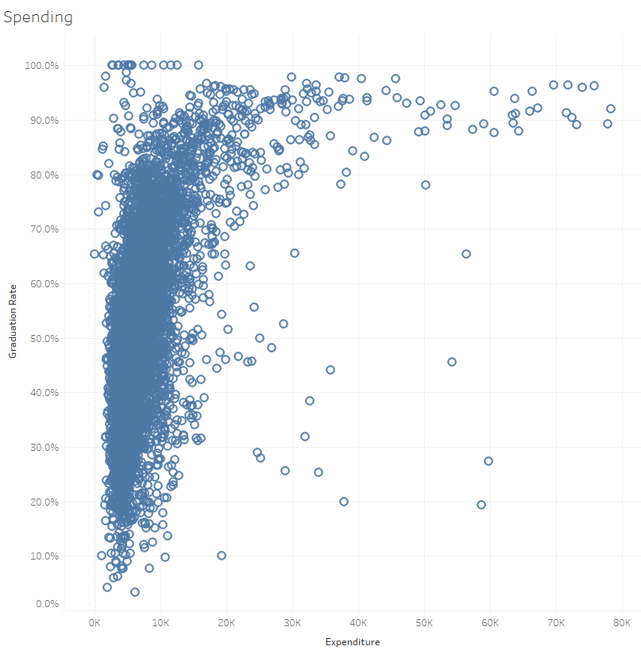
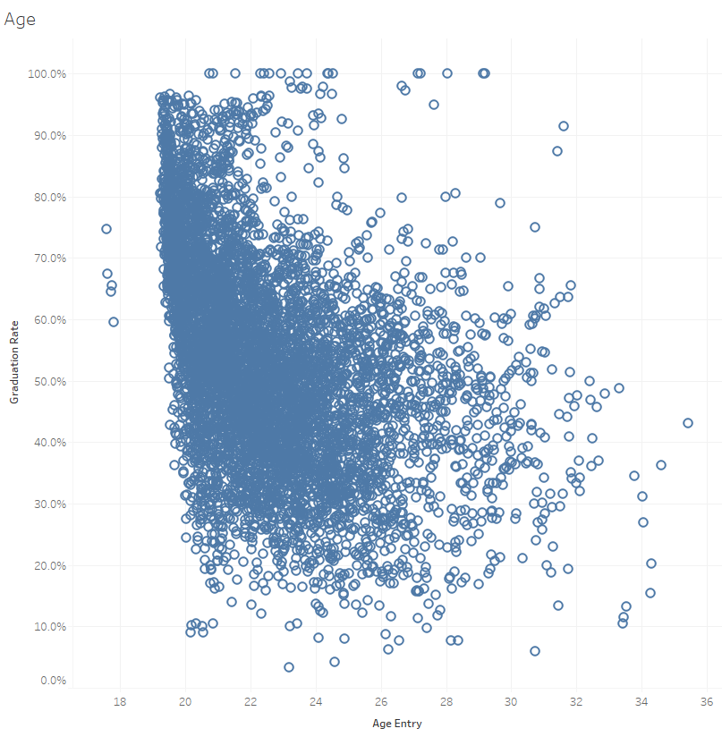
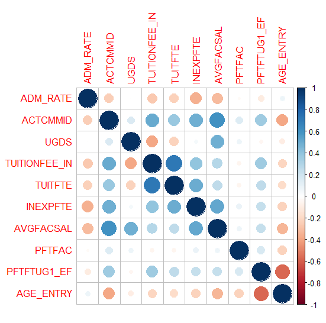
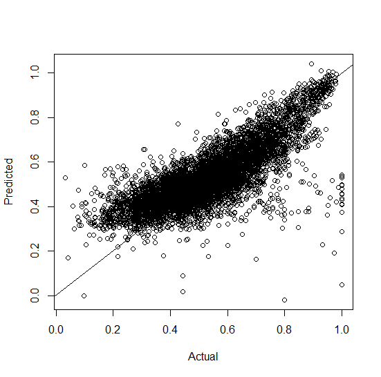
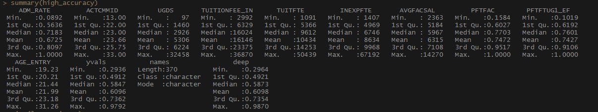

# Higher Education Analysis and Graduation Rate Prediction

This project is aimed at understand which demographic features of Higher Education institutions are important to graduation rates. It will also use deep learning modeling to create a predictive model as a tool for institutions.    

## Data Collection and Cleaning
Data was acquired from the following website:    
1. [data source 1]https://collegescorecard.ed.gov/data : This data set contains information about higher education institutions in the united states. Contains information such as Test scores, student body compositions, and financial data.

The data set originally contained 47,000 observation contained in 15 csv files for academic years from 2000-2015 with 1750 features. Using R the files were combined, reduced to 10 features and na values removed resulting in a data set of 6500 observations. The used features were then visualized using Tableau.

# Feature Selection and Analysis

*Admission Rate*

Through investigation of reported demographic information 10 factors were selected from higher education institution from the years 2000-2015.
The first feature used is the admission rate of the institution. From figure 1 it can be seen that in more exclusive institutions, where the admission rate is less than 50% the graduation rate tends to follow a predictable linear trend. This can be because of a variety of reasons. The most likely is that because of the exclusivity more determined students are attracted and thus more likely to complete the degree on time. For this feature, some of the outliers become interesting. Paul Quin college, a private liberal arts college from Dallas, Texas has a very low admission rates as well as very low graduation rates. A reason behind the low graduation rate is that Paul college is part of a very small group of 8 colleges which requires students to work full time while completing their degrees. This fact alone could lead to their low graduation rates as it is very difficult to graduate a 4-year program while working full time.

  
<b>Figure 1: </b> Admission rate      

*ACT score (median)*    
High school test scores can be a strong indicator of collegiate success, and is a strong factor in determining graduation rates. The outliers of this metric provide some insight as well, those which do not follow the normal trends tend to be heavily religious institutions. As such the average test score of these institutions does not reflect the graduation rate. The reason behind this could be related to the often extra religious credit requirements which could cause difficulty in graduating on time.

  
<b>Figure 2: </b> ACT Scores   

*Size*    
The size of an institution has a noticeable impact on the graduation rates, with larger institutions, the graduation rate trends to a normal distribution near the 50% mark, with smaller groups the laws of statistics take over and graduation rates are influenced more by other factors down to even the individual’s situation.

  
<b>Figure 3: </b> Institution size 

*Tuition Fee*    

Tuition fees can be strong indicators of graduation rate. Higher fees can be indicators of greater access to resources for the institution resulting in better support. In state and out of state tuition tend to be highly correlated so only ‘In State’ was used in this model. With this metric, the impact on graduation breaks down under a $7.5K tuition cost (figure 4), this could be an impact of more students having access to the education offered and other features becoming more prominent. This issue is resolved somewhat by including the net tuition fee.

  
<b>Figure 4: </b> Tuition In State 

  
<b>Figure 5: </b> Net Tuition 

*Instructional Expenditures*    

While tuition fees are good indicators of the potential resources of higher ed, they do not account for grants or the individual budgets. Because of this the expenditure per student is also included to indicate how much of the institutions resources are spent on the students. From this at about 30K/student graduation rates reach about 90%.

  
<b>Figure 6: </b> Spending 

*Faculty*    

Faculty salaries have a large impact on student success, similar to other features there is a high correlation between faculty salary and graduation rates. This is due to the likelihood that higher wages will lead to better and more motivated instructors. The outlier here is once again religious institutions, which could be that for those institutions the ideals are what drive strong instructors and not compensation.

  
<b>Figure 7: </b> Faculty Salary 

*Age of Entry*    

The age of entry of students plays a critical role in graduation rates. Initially it was though that older students would be more motivated and determined to finish degrees, however the actually tend to have lower graduation rates. This could be due to the fact that they would tend to have more external responsibilities causing difficulties in focusing on graduating on time

  
<b>Figure 8: </b> Age 

# Data Preparation

To ensure that none of these variables are highly correlated, they were input through a correlation matrix. Faculty salary is slightly correlated with average ACT scores, but should not be a problem.

  
<b>Figure 9: </b> correlation plot 

Initially the data set contained about 45,000 rows. However, many features were missing or unreported for many of these schools. An attempt was made to impute the missing values with the median of a localized cluster, but this was unsuccessful at creating a more accurate model. This modeling was attempted using the DWMR package. Ultimately it was elected to remove data points not containing all features resulting in a final data set of about 6500 rows.

## Analysis methods

Three models were tested for their effectiveness on modeling the data, a simple multilinear regression, random forest, and deep learning. The linear regression (figure 9) worked very well with an RSME of 11% which would be very effective. One will notice that at graduation rates under about 30% the model diverged more from actuals. The Deep learning algorithm performed slightly better with an RSME of only 9% (figure 10). The deep learning model was trained utilizing the 'h2o' API which has pluggins to integrate well with R and Python.This model was trained using default parameters using 2 hidden layers with 200 nodes each. Hyper-parametrization did not improve performance or accuracy.

## Results

  
<b>Figure 10: </b> linear regression 

  
<b>Figure 11: </b> Deep learning 

To evaluate the performance of the model I wanted to look at the schools first in which the model had very high accuracy. These were schools with which it predicted to within 1% of the actual graduation rate. Fortunately of the 370 data points which fit this criteria there were no common similarities, and a wide range of each of the features was captured. This shows that the model was proficient at a large range of schools and not over fit to a particular type.

  
<b>Figure 12: </b> High Accuracy Summary 

Next, I looked at schools which had the largest misses. These all had an error larger than 30%. These schools were all very similar which is good in that it provides an understanding of which types of school the model is less effective on. What was shown is that the schools tended to be small and inexpensive.

<b>Figure 13: </b> Summary of Low Accuracy 

Finally, some performance metrics were calculated to provide some idea to the level of accuracy which to expect from the model. These were bucketed accuracy at different levels, within 90%, 95%, and 99% (table 1).

||Bucket||	||Percent||    
||90%||	||49.6||    
||95%||	||27.0||    
||99%||	||5.6||

## Summary
While this model demonstrates an accurate and useable model, it still has room for improvement. There is potential to attempt better imputation methods, as well as finding a more complete data set to train on. The other piece that would be useful would be determining a way to identify religious institutions as many of the outliers appeared to have a religious affiliation. This could be done via text mining on the institution's name or even incorporating their mission statement.
